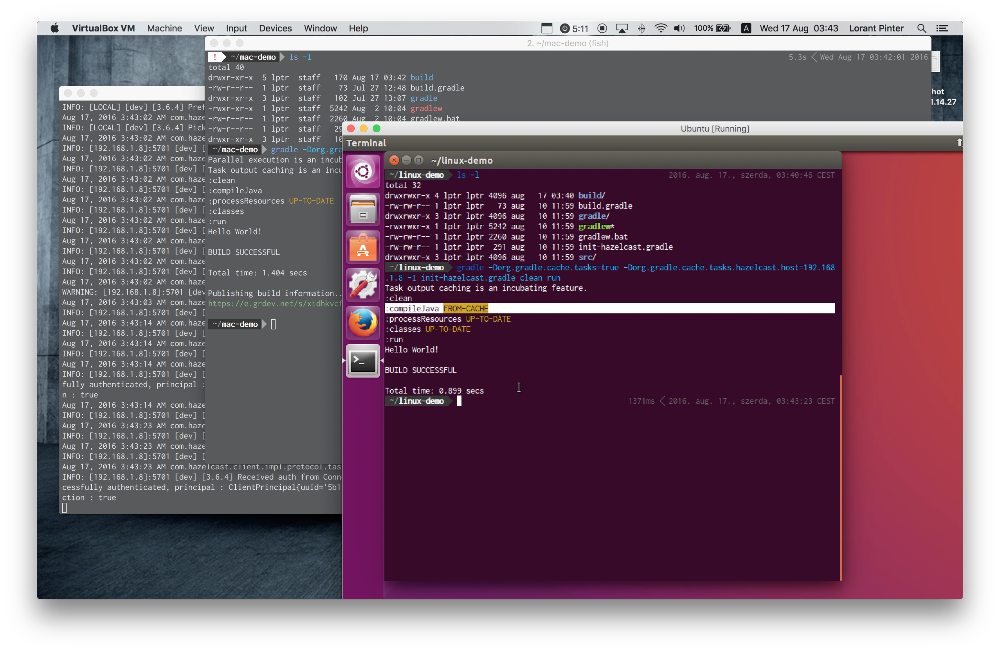

# Using a Hazelcast backend service

[](https://youtu.be/taiO-5l428g)

This scenario demonstrates the use of a cache backend service. The first part of the scenario demonstrates using the backend service locally. The second part shows how it works when the backend is accessed from builds running on different hosts.

We are going to use a [Hazelcast](http://hazelcast.org) node as the cache backend. An [settings](https://docs.gradle.org/current/dsl/org.gradle.api.initialization.Settings.html) implements the connection between the Gradle build tool and the Hazelcast node. This plugin is not part of the Gradle distribution, but is a standalone plugin that lives in the [`gradle-hazelcast-plugin` repository](https://github.com/gradle/gradle-hazelcast-plugin). It also serves as the reference implementation for Gradle cache backend support. Plugins supporting other backends (like Redis, Varnish etc.) can be created in a similar way by implementing the `BuildCacheServiceFactory` interface like [it is done in the Hazelcast plugin](https://github.com/gradle/gradle-hazelcast-plugin/blob/0.6/src/main/java/org/gradle/caching/hazelcast/HazelcastPlugin.java).

Hazelcast itself is an in-memory data store, so it will only keep track of the cached data as long as the Hazelcast node itself is running. This makes it easy to discard the cached data when needed by restarting the node. Hazelcast can work as a distributed cache with nodes talking to each other. For this scenario, we are going to create a centralized cache service with a single standalone node. **NOTE:** This sample is fine for simple testing, but the Hazelcast node will drop data when it reaches capacity. For real world usage, the local cache, a distributed Hazelcast system or the HTTP backed cache are better solutions.


## Preparations

We first need the standalone Hazelcast node to be up and running. For this, let's build the `hazelcast-server` tool first:

```text
$ cd hazelcast-server
$ ./gradlew installDist
:compileJava
:compileGroovy UP-TO-DATE
:processResources UP-TO-DATE
:classes
:jar
:startScripts
:installDist
```

Now we can fire up the Hazelcast node:

```text
$ build/install/hazelcast-server/bin/hazelcast-server run
Jul 27, 2016 1:17:30 PM com.hazelcast.instance.Node
WARNING: [192.168.1.7]:5701 [dev] [3.6.4] No join method is enabled! Starting standalone.
```

We are now ready to use the cache!

## Testing locally

The configuration for task caching now happens in the [`hazelcast-test/settings.gradle`](hazelcast-test/settings.gradle). It applies the [`gradle-hazelcast-plugin`](https://github.com/gradle/gradle-hazelcast-plugin) which enables task output caching via a Hazelcast backend.

Let's run the build on the same machine. The default settings should work fine:

```text
$ cd hazelcast-test
$ ./gradlew -Dorg.gradle.cache.tasks=true clean run
Task output caching is an incubating feature.
:clean
:compileJava
:processResources UP-TO-DATE
:classes
:run
Hello World!
```

At this time, the results of `:compileJava` and `:jar` were stored in the cache.

**Note:** Running the `clean` task as part of the build is a safety measure. If the build has already been executed, this removes any output present in the `build` directory. Had we not done this, the incremental build feature in Gradle could mark some tasks as `UP-TO-DATE`, which in turn would prevent the task from executing even before the new caching mechanism could kick in.

Let's run the build again:

```text
$ ./gradlew -Dorg.gradle.cache.tasks=true clean run
Task output caching is an incubating feature.
:clean
:compileJava FROM-CACHE
:processResources UP-TO-DATE
:classes UP-TO-DATE
:run
Hello World!
```

Notice how `:compileJava` is now `FROM-CACHE`.


## Using the cache from a different host

Let's try to use the stored results from another computer. We're going to specify the Hazelcast node's host via the `org.gradle.caching.hazelcast.host` system property. When started, the Hazelcast server will print its IP address.

Let's run the same build from a different machine:

```text
$ ./gradlew -Dorg.gradle.cache.tasks=true -Dorg.gradle.caching.hazelcast.host=192.168.1.7 clean run
Task output caching is an incubating feature.
:clean
:compileJava FROM-CACHE
:processResources UP-TO-DATE
:classes UP-TO-DATE
:run
Hello World!
```
You can also specify the host of the Hazecalst service via the `settings.gradle`:

```groovy
remote(org.gradle.caching.hazelcast.HazelcastBuildCache) {
    host = "192.168.1.7"
    port = 5701
}
```

### Troubleshooting

If running from different computers does not have the desired result (i.e. `:compileJava` being in `FROM-CACHE` state), check if the version of Java the same on both computers.

### Changing the Hazelcast TCP port

It is also possible to set the TCP port used explicitly via the `org.gradle.caching.hazelcast.port` property (the default is `5701`):

```text
$ hazelcast-server/build/install/hazelcast-server/bin/hazelcast-server run --port 5710
Jul 27, 2016 1:55:58 PM com.hazelcast.instance.Node
WARNING: [192.168.1.7]:5710 [dev] [3.6.4] No join method is enabled! Starting standalone.
```

### More about the Hazelcast server tool

The server tool has some more options:

```text
$ hazelcast-server/build/install/hazelcast-server/bin/hazelcast-server help run
NAME
        hazelcast-server run - run a Hazelcast server

SYNOPSIS
        hazelcast-server run [(-d | --debug)] [(-M | --enable-multicast)]
                [(-p <port> | --port <port>)] [(-q | --quiet)] [(-v | --verbose)]

OPTIONS
        -d, --debug
            debug mode

        -M, --enable-multicast
            enable multicast discovery

        -p <port>, --port <port>
            port to start the server on, defaults to 5701

        -q, --quiet
            quiet mode, only print errors

        -v, --verbose
            verbose mode
```
